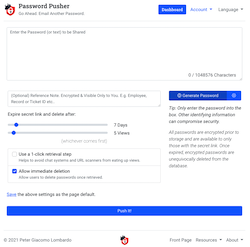
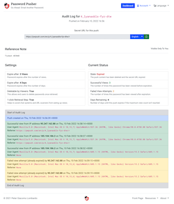
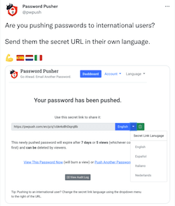
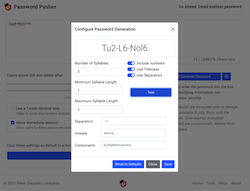
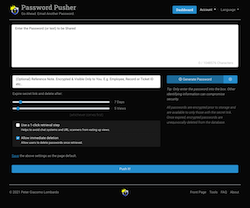
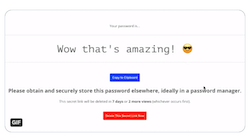

<div align="center">


__Simple & Secure Password Sharing with Auto-Expiration of Shared Items__

[](https://twitter.com/pwpush)


[](https://hub.docker.com/repositories)

[](https://github.com/PhxDesign/PasswordPusher/actions/workflows/ruby.yml)
[](https://circleci.com/gh/pglombardo/PasswordPusher/tree/master)
[](https://github.com/pglombardo/pwpush-cli/pulls?utf8=%E2%9C%93&q=is%3Apr%20author%3Aapp%2Fdependabot)
[](https://github.com/pglombardo/pwpush-cli/releases)
[](https://github.com/PhxDesign/pwpush/blob/master/LICENSE)

</div>

------

Password Pusher est une application opensource permettant l'échange de secrets à partir du web. L'accès au secret expire après un certain temps ou un nombre de vue.

Hébergé à [pwpush.com](https://pwpush.com) vous pouvez tout de même utiliser votre propre instance en quelques étapes.

* __Facile-à-installer:__ Hébergez par vous-même via Docker, un service cloud ou utilisez simplement [pwpush.com](https://pwpush.com)
* __Opensource:__ Sans code blackbox. Uniquement du code source analysé, testé et approuvé.
* __Journalisation:__ Vérifiez et contrôlez ce que vous partagez et qui a visualisé.
* __Stockage crypté:__ Toutes les données sensibles sont cryptées et supprimées une fois expiré.
* __Auto hébergé:__ Avec base de données ou données éphémère, exécutez votre propre instance isolé du reste du monde.
* __JSON API:__  JSON API brute disponible à partir d'utilitaires tiers ou via ligne de commande `curl` ou `wget`.
* __En ligne de commande:__ Automatisez la distribution de secret avec les outils en CLI ou des scripts spécifiques.
* __Version internationale:__ Inclus la traduction en 14 langues facilement paramétrables via UI ou URL
* __Page d'accueil vierge:__ Sans logo, sans texte ou lien superflus portant les utilisateurs à confusion.
* __Paramétrable:__ Modifiez les textes ou les options par défaut à partir de variables d'environnement.
* __Thême clair et foncé:__  À partir de CSS @media integration, l'aspect visuel de votre site suit vos préférences.
* __10 ans:__ Password Pusher a délivré sécuritairement plusieurs millions de secrets dans les 10 dernières années.
* __Logiciel fiable:__  Code source écrit et maintenu par  [pglombardo](https://github.com/pglombardo) avec l'aide de très bons contributeurs. Aucune organisation, compagnie ou intention cachée.

Suivez Password Pusher [sur Twitter](https://twitter.com/pwpush), [Gettr](https://gettr.com/user/pwpush) ou [on Facebook](https://www.facebook.com/pwpush) pour les dernières nouveautés, mises à jour et changements.

-----

[](./app/frontend/img/features/front-page-large.png)
[](./app/frontend/img/features/audit-log-large.png)
[](./app/frontend/img/features/secret-url-languages-large.png)
[](./app/frontend/img/features/password-generator-large.png)
[](./app/frontend/img/features/dark-theme.gif)
[](./app/frontend/img/features/preliminary-step.gif)

# Démarrage rapide

→ Visitez [pwpush.com](https://pwpush.com) et essayez-le.

_ou_

→ Exécutez votre propre instance à l'aide d'une commande: `docker run -d -p "5100:5100" pglombardo/pwpush-ephemeral:release` puis accédez à http://localhost:5100

_ou_

→ Utilisez un des [utilitaires tiers](#3rd-party-tools) qui interagissent avec Password Pusher.

# 💾 Exécutez votre instance

_Note: Password Pusher peut être configuré facilement à partir des variables d'environnements, une fois le déploiement complété n'oubliez pas de lire [la page de configuration](Configuration.md). Portez une attention particulière à la configuration de votre propre clé de cryption, qui n'est pas obligatoire, mais qui représente l'approche la plus sécuritaire pour votre instance._

## Sur Docker

Image Password Pusher disponible sur Docker à [Docker hub](https://hub.docker.com/u/pglombardo).

**➜ ephemeral**
_Données temporaire qui sont effacées lors du redémarrage du container._

    docker run -d -p "5100:5100" pglombardo/pwpush-ephemeral:release

[Apprenez en plus](https://github.com/PhxDesign/PasswordPusher/tree/master/containers/docker#pwpush-ephemeral)

**➜ Utilisez une base de données externe Postgres**
_Instance de base de données Postgres._

    docker run -d -p "5100:5100" pglombardo/pwpush-postgres:release

[Apprenez en plus](https://github.com/PhxDesign/PasswordPusher/tree/master/containers/docker#pwpush-postgres)

__➜ Utilisez une base de données externe MariaDB (MySQL)__
_Instance de base de données Mariadb._

    docker run -d -p "5100:5100" pglombardo/pwpush-mysql:release

[Apprenez-en plus](https://github.com/PhxDesign/PasswordPusher/tree/master/containers/docker#pwpush-mysql)

_Note: Pour une plus grande stabilité, utilisez la ['release' ou version'd tags](https://hub.docker.com/repository/docker/pglombardo/pwpush-ephemeral/tags?page=1&ordering=last_updated)._

## Avec Docker Compose

**➜ Password Pusher avec base de données Postgres**

    curl -s -o docker-compose.yml https://raw.githubusercontent.com/PhxDesign/PasswordPusher/master/containers/docker/pwpush-postgres/docker-compose.yaml && docker compose up -d

**➜ Password Pusher avec base de données MariaDB (MySQL)**

    curl -s -o docker-compose.yml https://raw.githubusercontent.com/PhxDesign/PasswordPusher/master/containers/docker/pwpush-mysql/docker-compose.yaml && docker compose up -d

## Sur Kubernetes

Les instructions et les explications pour la configuration Kubernetes [sont disponibles ici](https://github.com/pglombardo/PasswordPusher/tree/master/containers/kubernetes).

## Sur Microsoft Azure

_Il y avait un blogue tiers qui partageait les instructions, mais il n'est plus disponible. Si quelqu'un a les informations ou veut contribuer, ce serait fort apprécié._

Regardez [issue #277](https://github.com/pglombardo/PasswordPusher/issues/277)

## Sur OpenShift

Regardez-la [documentation OpenShift](https://github.com/PhxDesign/PasswordPusher/tree/master/containers/docker#pwpush-openshift).

## Sur Heroku

Déploiement en un clic sur [Heroku Cloud](https://www.heroku.com) qui ne requière aucun serveur.

[](https://heroku.com/deploy?template=https://github.com/pglombardo/PasswordPusher)

_Cette option déploiera une instance de production de Password Pusher incluant une base de données Postgres. Puisque le coût mensuel est approximativement: $0._

## Depuis la Source

Assurez-vous d'avoir git et Ruby d'installé et puis:

```sh
git clone git@github.com:PhxDesign/PasswordPusher.git
cd PasswordPusher
gem install bundler
bundle install --without development production test --deployment
bundle exec rake assets:precompile
RAILS_ENV=private ./bin/rake db:setup
./bin/rails server --environment=private
```

Puis accédez au site @ [http://localhost:5100/](http://localhost:5100/).

# Outils tiers

## Utilitaires en ligne de commande

* [pgarm/pwposh](https://github.com/pgarm/pwposh): un module PowerShell disponible dans la [Gallerie PowerShell](https://www.powershellgallery.com/packages/PwPoSh/)

* [kprocyszyn/Get-PasswordLink.ps1](https://github.com/kprocyszyn/tools/blob/master/Get-PasswordLink/Get-PasswordLink.ps1): un CLI basé sur PowerShell *  [lnfnunes/pwpush-cli](https://github.com/lnfnunes/pwpush-cli): un CLI basé sur Node.js * [abkierstein/pwpush](https://github.com/abkierstein/pwpush): un CLI basé sur Python ## Libraries & APIs

* [oyale/PwPush-PHP](https://github.com/oyale/PwPush-PHP): une librairie PHP wrapper pour distribuer facilement les secrets à partir d'une instance Password Pusher

## Application Android

*  [Pushie](https://play.google.com/store/apps/details?id=com.chesire.pushie) by [chesire](https://github.com/chesire)

## Intégration aux applications

* [Slack: comment ajouter une commande personnalisée Slash](https://github.com/pglombardo/PasswordPusher/wiki/PasswordPusher-&-Slack:-Custom-Slash-Command)

* [Unraid Application](https://forums.unraid.net/topic/104128-support-passwordpusher-pwpush-corneliousjd-repo/)

* [Alfred Workflow](http://www.packal.org/workflow/passwordpusher) pour les utilisateurs Mac

# API pour Password Pusher

* [JSON API](https://github.com/pglombardo/PasswordPusher/wiki/Password-API)

# Internationalisation

Password Pusher est présentement disponible en **14 langues** et d'autres s'ajoutes en fonction des volontaires.

À partir de l'application, la langue est sélectionnée via le menu. À la première exécution, la langue par défaut est anglaise.

## Modifier la langue par défaut

La langue par défaut peut être modifiée à l'aide la variable d'environnement et le code de langue approprié:

    PWP__DEFAULT_LOCALE=fr

Pour plus de détails, une liste des codes de langue et les explications sont disponibles au bas de ce [fichier de configuration](https://github.com/pglombardo/PasswordPusher/blob/master/config/settings.yml).

# 📼 Crédits

## Traducteurs

Merci à tous ces bons traducteurs!

Si vous voulez participer ou nous assister pour la traduction, visitez [cette page](https://pwpush.com/en/pages/translate).

* Catalan
  * [Oyale](https://github.com/oyale)

* Danois
  * Finn Skaaning

* Français
  * [Thibaut](https://github.com/tibo59)

* Allemand
  * Thomas Wölk: [Github](https://github.com/confluencepoint/) | [Twitter](https://twitter.com/confluencepoint)
  * Martin Otto

* Norégien
  * Robin Jørgensen

* Polonais
  * [Łukasz](https://github.com/drpt)

* Portugais
  * [Jair Henrique](https://github.com/jairhenrique/)
  * [Fabrício Rodrigues](https://www.linkedin.com/in/ifabriciorodrigues/)
  * [Ivan Freitas](https://github.com/IvanMFreitas)
  * Sara Faria

* Espagnol
  * [Oyale](https://github.com/oyale)

* Suédois
  * johan323
  * Fredrik Arvas

Aussi merci à [translation.io](https://translation.io) pour leur très bon service de gestion de la traduction. C'est aussi un projet opensource.

## Containers

Merci à:

* [@fiskhest](https://github.com/fiskhest) les [instruction d'installation Kubernetes](https://github.com/PhxDesign/PasswordPusher/tree/master/containers/kubernetes).

* [@sfarosu](https://github.com/sfarosu) pour [la contribution](https://github.com/pglombardo/PasswordPusher/pull/82) du soutien au container Docker, Kubernetes & OpenShift.

## Autres

Merci à:

* [@iandunn](https://github.com/iandunn) pour un meilleur formulaire des secrets sécurisés.

* [Kasper 'kapöw' Grubbe](https://github.com/kaspergrubbe) pour le [fix JSON POST](https://github.com/pglombardo/PasswordPusher/pull/3).

* [JarvisAndPi](http://www.reddit.com/user/JarvisAndPi) pour le design du favicon

...et encore plus.  Visitez la [page des contributeurs](https://github.com/PhxDesign/PasswordPusher/graphs/contributors) pour plus de détails.